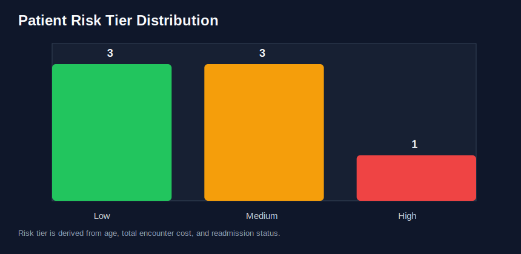
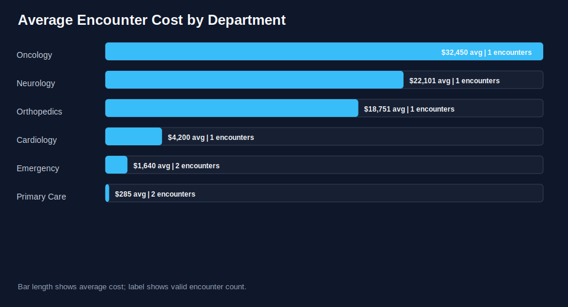

# Healthcare ETL Pipeline

Production-style Python ETL project for synthetic healthcare encounter data. The pipeline extracts raw CSV records, validates data quality, standardizes patient and encounter fields, writes curated CSV tables, loads a SQLite analytics warehouse, and publishes quality reports and charts.

This repository is designed as a data-engineering portfolio project: lightweight enough to run immediately, but structured like a real batch ETL workflow with tests, CI, schema outputs, rejected-row auditing, and analytics-ready deliverables.

## Problem

Healthcare encounter data often arrives as messy flat files. Before analysts can use it, the data needs to be validated, standardized, split into useful tables, and loaded into a queryable warehouse.

This project answers:

> Can we turn raw encounter records into clean patient, encounter, and data-quality outputs that are ready for analytics?

## Demo Outputs

The included sample run produces quality metrics and lightweight SVG charts that render directly on GitHub.





## What It Demonstrates

- Batch ETL design with separate extract, transform, and load modules
- Data-quality validation for required fields, dates, duplicates, booleans, and costs
- Rejected-row audit table with row numbers and rejection reasons
- Healthcare transformations including age, length of stay, readmission flag parsing, and risk tiering
- Curated CSV outputs plus SQLite warehouse loading
- JSON quality report and GitHub-renderable SVG charts
- Unit tests and GitHub Actions CI
- Standard-library implementation with no runtime dependency setup

## Repository Structure

```text
.
├── data/
│   ├── raw/                         # Source CSV sample
│   └── processed/                   # Generated outputs ignored by Git
├── docs/
│   ├── assets/demo/                 # Committed sample reports/charts for README
│   └── architecture.md
├── examples/
│   ├── analytics_queries.sql
│   └── portfolio_walkthrough.md
├── src/
│   └── healthcare_etl/
│       ├── cli.py
│       ├── extract.py
│       ├── load.py
│       ├── pipeline.py
│       ├── transform.py
│       └── visualization.py
├── tests/
│   └── test_pipeline.py
├── pyproject.toml
└── README.md
```

## Quick Start

Install the package in editable mode:

```bash
python3 -m pip install -e .
```

Run the ETL pipeline:

```bash
healthcare-etl
```

Expected output:

```text
Pipeline complete
Valid encounters: 8
Rejected rows: 2
Output directory: /path/to/ETL_Pipeline/data/processed
SQLite warehouse: /path/to/ETL_Pipeline/data/processed/healthcare_warehouse.db
```

Generated files:

- `data/processed/patients.csv`
- `data/processed/encounters.csv`
- `data/processed/rejected_rows.csv`
- `data/processed/data_quality_report.json`
- `data/processed/risk_tiers.svg`
- `data/processed/department_costs.svg`
- `data/processed/healthcare_warehouse.db`

## Example Quality Report

```json
{
  "valid_encounters": 8,
  "rejected_rows": 2,
  "patients": 7,
  "risk_tier_counts": {
    "High": 1,
    "Low": 3,
    "Medium": 3
  }
}
```

## Data Model

### `patients`

One row per patient with demographics, calculated age, and highest observed risk tier.

### `encounters`

One row per valid encounter with admission/discharge dates, department, diagnosis, procedure code, total cost, readmission flag, and calculated length of stay.

### `rejected_rows`

Rows that failed validation, including source row number, patient ID, encounter ID, and rejection reason.

## Analytics Queries

Run the included SQL examples after the pipeline completes:

```bash
sqlite3 data/processed/healthcare_warehouse.db < examples/analytics_queries.sql
```

Example queries include:

- patient count by risk tier
- average encounter cost by department
- department-level readmission rate
- rejected-row audit review

## Tests

```bash
python3 -m unittest discover -s tests
```

## Portfolio Notes

This project is intentionally synthetic and contains no protected health information. It is meant to demonstrate ETL design, auditability, and analytics output patterns. The same structure can be extended to larger healthcare feeds, cloud storage inputs, orchestration tools, or a warehouse such as Postgres, BigQuery, or Snowflake.

See [docs/architecture.md](docs/architecture.md) and [examples/portfolio_walkthrough.md](examples/portfolio_walkthrough.md) for more detail.

## License

MIT License.
